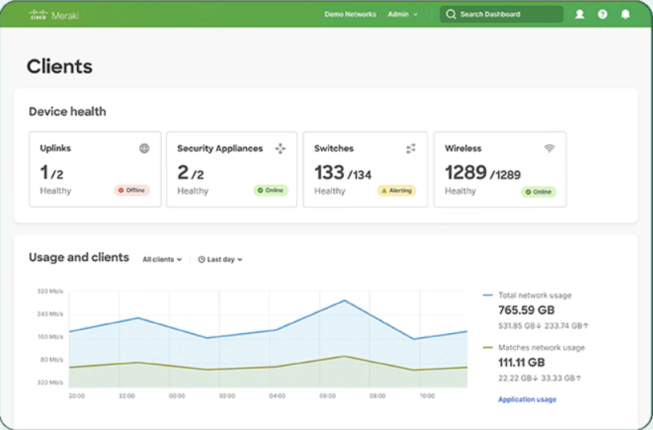

# Introduction

This workshop will take you through the steps it takes to create an AWS Lambda function, create an AWS API endpoint, code a simple function to respond to a webhook from the Meraki Dashboard, and create a custom webhook template for the Meraki Dashboard.

We will start with getting the information we need from the Meraki Dashboard.
