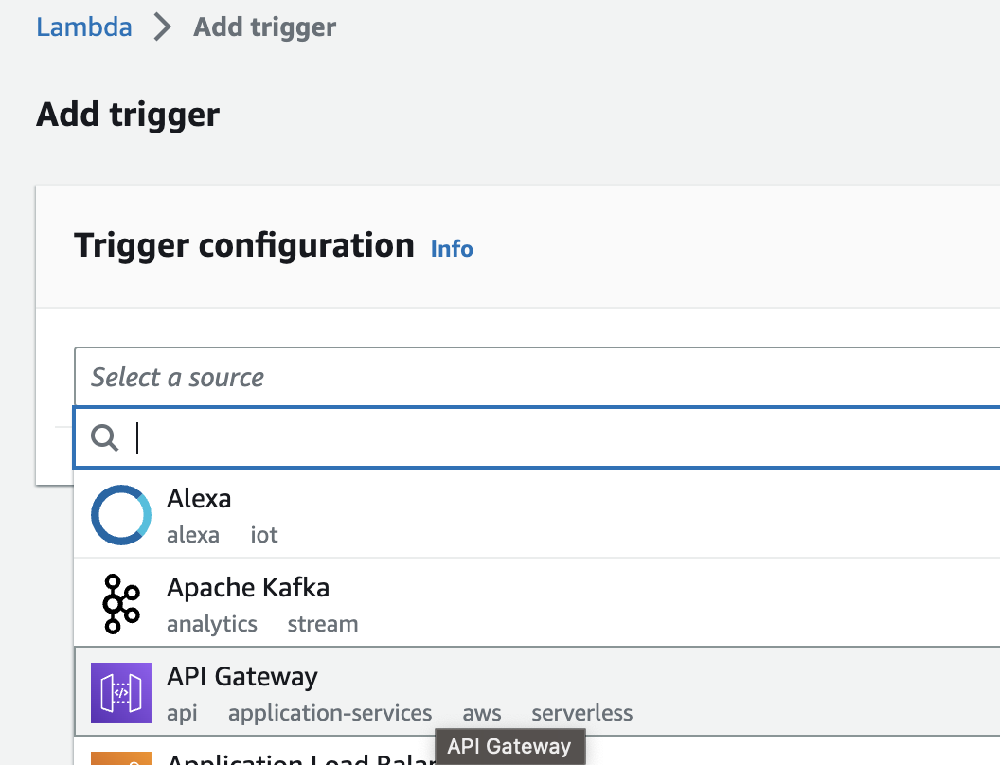
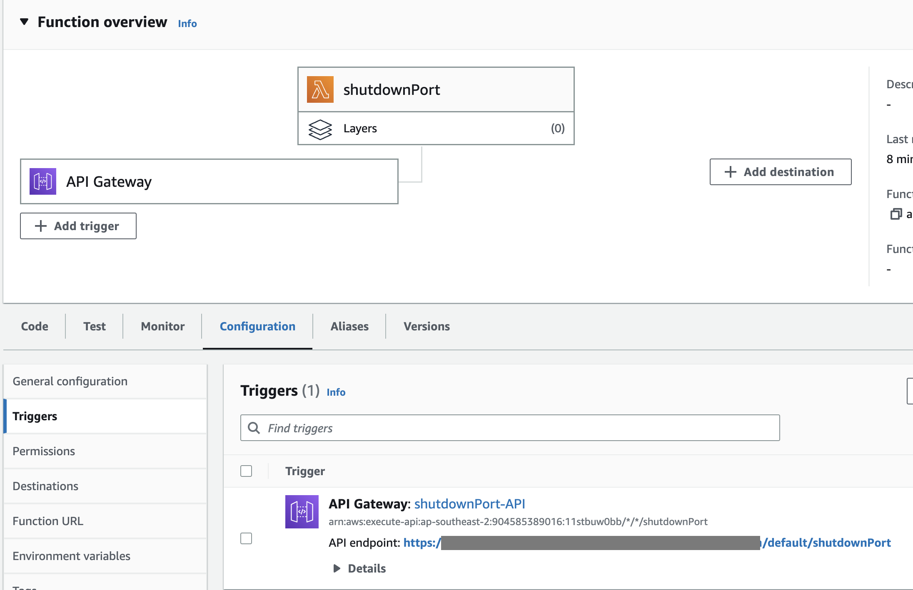

# API Gateway

## Create the API Gateway

Now that we have a working Lambda function, we can add an API gateway to receive the request. This process is much quicker than creating the Lambda function.

To add the API gateway to our function, we need to add a `trigger`, use the API Gateway as the trigger and leave the auth open.

### Add a Trigger

To add a `Trigger`, go to the Lambda function page and within the **Function overview** click on **Add trigger**.

After the **Add trigger** button has been clicked it will load another page called **Add trigger**. It has a drop down for selecting the trigger source. Click on the drop down and choose the **API Gateway**.

Once the API Gateway has been selected an **Intent** section will show up. Select **Create a new API**. Once that has been selected it will ask for the **API type** and for the **Security** configuration. Select **HTTP API** for the type and change the **Security** to **Open**. The configuration should look like the below image:

Click on **Add** on the bottom to create the new API Gateway. If the creation was successful, there should now be a trigger to the left of the Lambda function and a new trigger at the bottom of the window.

### Update Meraki Dashboard Webhooks

Copy the **API endpoint** URL of the new trigger and open the Meraki Dashboard. Go to `Systems Manager -> Alerts` and scroll down to the **Webhooks** section. Click on **Add an HTTPS receiver**.
Give the webhook a meaningful name, (we used `aws`) and paste the API Endpoint URL into the **URL** box. Click on **Save** at the bottom of the page.

We have now configured an API Gateway to be used with the Lambda function and can now test the functionality.
