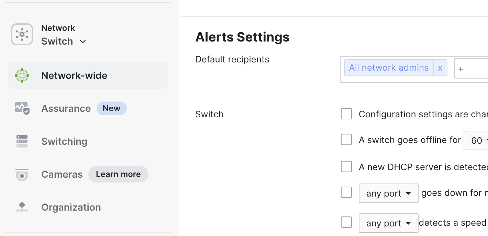
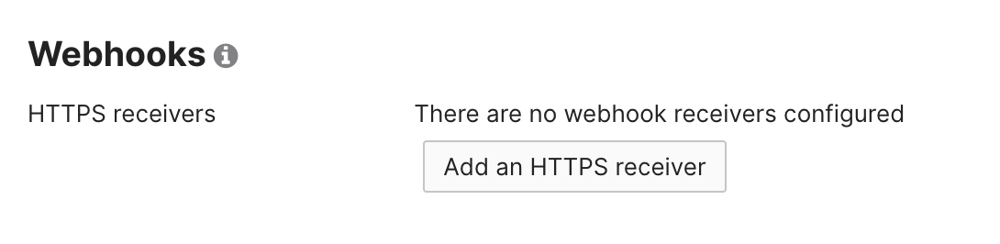
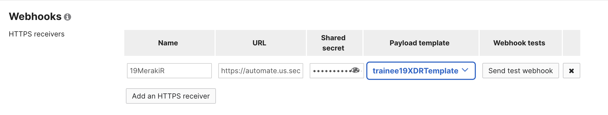

# Testing The Deployment

Remember the XDR Webhook API Key and URL we mentioned to save. Now we get to use them.

1. Go back to the Meraki Dashboard.

2. Go to **Network-wide -> Alerts**
   

3. Scroll to the bottom and click on **Add an HTTPS Receiver**
   

4. Give the receiver a name similar to your stationidMerakiR, ex: _19MerakiR_

5. Fill in the receiver fields with the Webhook API key and URL. The URL goes into the **URL** field, and the API key goes into the **Shared Secret** field.

6. Change the **Payload Template** to the template that was created earlier. It should look similar to the below:
   

7. Click on **Send test Webhook**

If everything went well, the port on the switch should now be in a disabled state.

This concludes the workshop. Thank you for attending.
