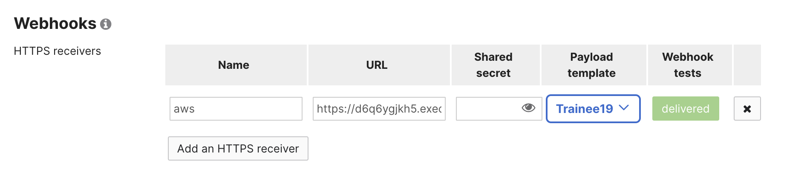
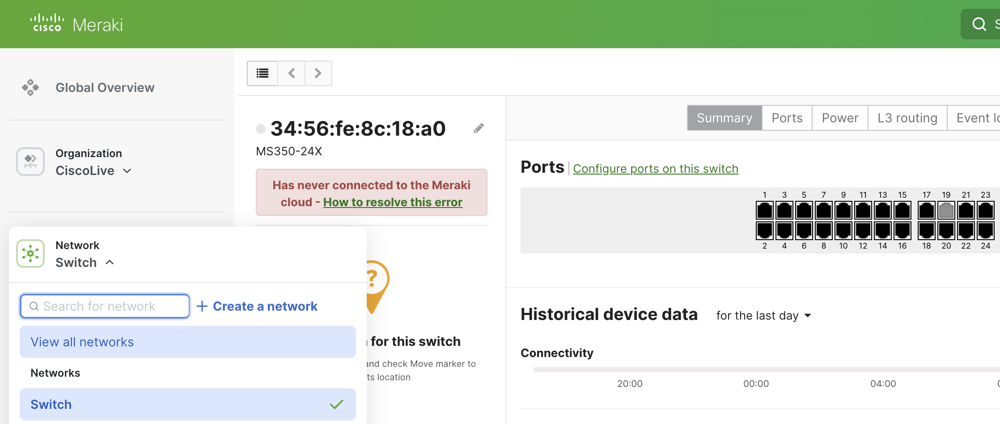

# Testing the Deployment

We have a few tests that we can perform to validate our deployment is going to work. We will check the Meraki Dashboard to validate that it can send webhooks to our API, then we will generate our own example to send, and finally we will have the Meraki Dashboard send a legitimate event to our API.

## Test Using The Meraki Dashboard

Within the Meraki Dashboard on the Alerts page where we just setup a new webhook, click on the **Send test webhook** button to verify that Meraki can successfully send a webhook.

After clicking on the button and waiting a little while, we should see a status of `delivered`, like the below image shows:

This webhook test we performed will send the template we created to the Lambda function and the Lambda function will detect that it is a port disconnected event. It will then reach back out to Meraki and shutdown your assigned port. To check if the port was successfully shutdown we can go to the `Switch` network and select the switch to see the port is now gray instead of black.

