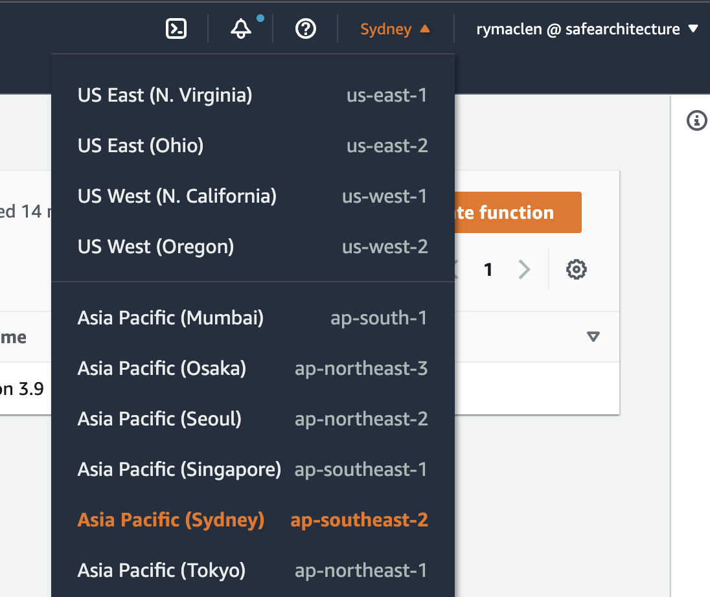
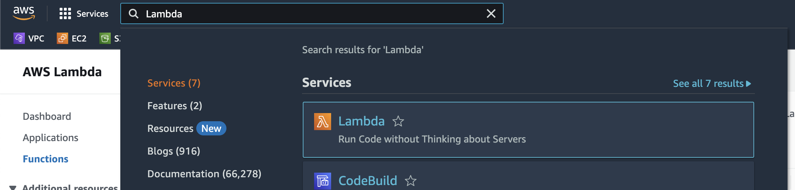

# Getting Started

The major steps for making a Lambda function that can receive webhooks are below:

- AWS Login
- Create a Lambda Function
- Code the Lambda Function
- Lambda Function Testing
- Create an API Endpoint
- Full Test with the Meraki webhook

## AWS Login

Please sign into AWS using your own credentials or the credentials provided. Here is a link to the **[AWS login](https://aws.amazon.com/)**. Click on the **Sign In** button on the top right to sign in. Please sign in as a `IAM` user using the credentials provided.

:::tip
You can use your own account for the entire workshop. There is nothing being done in AWS that requires the login we give you.
:::

### Change the AWS Region

After getting signed in, change the region you are in to the region specified on the login sheet unless you are using your own account. To change the region, look to the top right of the page and to the left of where it has your username, there will be a location name. Select it and then change the region to the one on your sheet. It should look like this image below:

After the region has been changed, we can now work on our Lambda function without impacting anyone else.

### Open AWS Lambda Page

To open the AWS Lambda page, we need to search for **Lambda** in the search bar on the top left and select it. The search should look like this screenshot:

