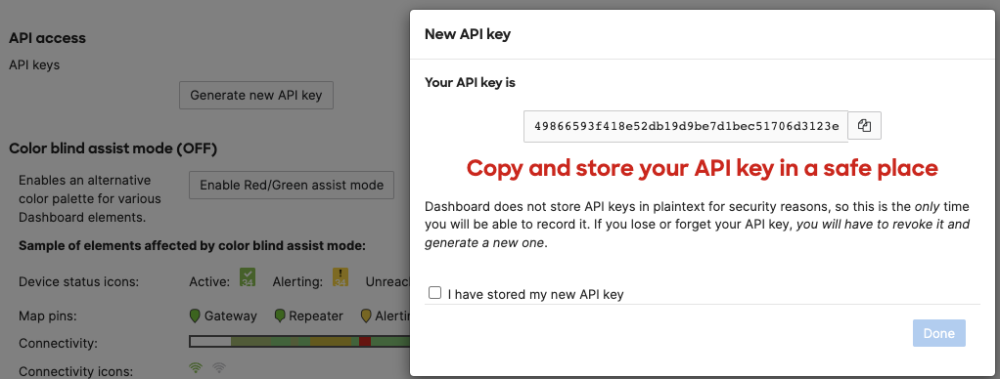

# Create & Save Meraki API key, ORG ID, and Network

In this section, we will go through the process of obtaining a Meraki API key and Organization ID.

First we need to sign in to the Meraki dashboard using [dashboard.meraki.com](https://dashboard.meraki.com).

It should take you to a login page for the Meraki Dashboard. Please sign in using the credentials provided to you. If asked for an Organization to log into. Please choose the `CiscoLive` organization.

After getting logged in, we need to generate an API key.

## Create Meraki API Key

Go to the top right where it has your username and select it. A drop down should show up and then select `My Profile`. It should look similar to what is below:  

After your profile loads, scroll down to the **API access** section. Then click on `Generate new API key`.

It will bring up a popup that has your API key like in the below image:  

Copy the API key and store it in a file locally. Then check the `I have stored my new API key` box and click on done.

Now we need to find our Organization ID.

## Save the Organization ID

Since we are in the profile page, scroll all the way to the bottom. In the footer, there will be some text mentioning the last login from your current IP. Below that information is the Organization ID. Copy that value and save it in the same file as the API key. It should look similar to the image below:  

## Get the Network ID

If you look on the left hand side of the page, we'll have:

`Network` -> `traineeX` -> `Systems Manager`

Where the **X** is the number of your trainee login.

If you click on `Systems Manager` then `General` and scroll to the bottom, in the `SecureX` section, you should see the **_Network ID_** Make a copy of this.

:::note

**_Alternatively_** if you are doing this in the future, you can get the Network ID a different way using the Meraki Dashboard API

Go to the [Meraki Developer](https://developer.cisco.com/meraki/api-latest/) documentation. Once here, please search for `Get Organization Networks` in the search bar on the left. It should load the API page for that call. Now click on the `Configuration` button on the right side. Replace the `APIKey in header` field with the one you generated earlier. The rest can be left alone, click `Save`.

Still on the right side, please enter the Organization ID we obtained earlier in the `Organization Id` box. Then click on `Run`. It will return the networks associated with your account. Near the bottom, your network should should up. It wil be named after your username. Please save the `id` field.

:::

Now we can start working with the Meraki API and a create a custom webhook.
