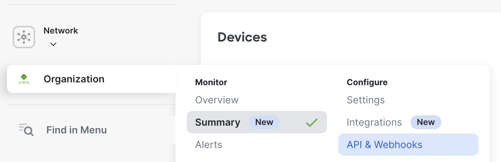
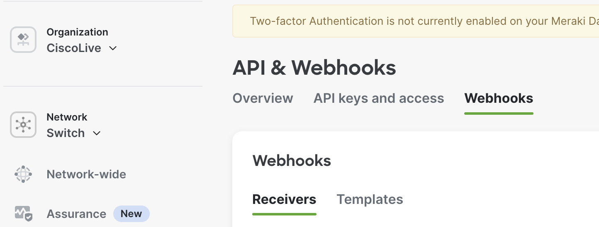
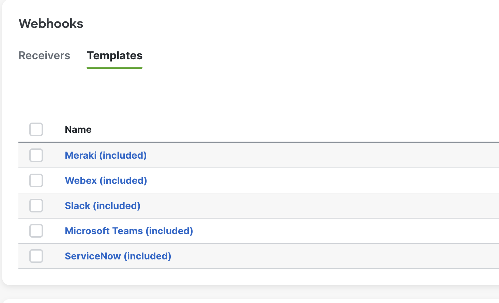
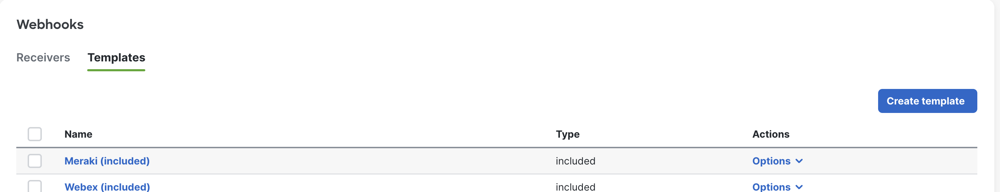
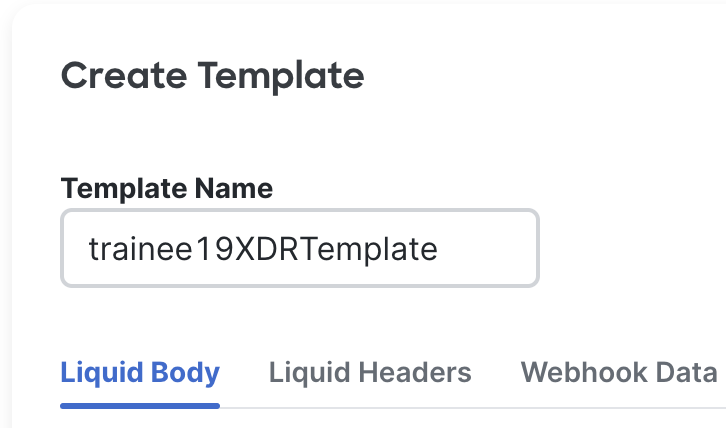
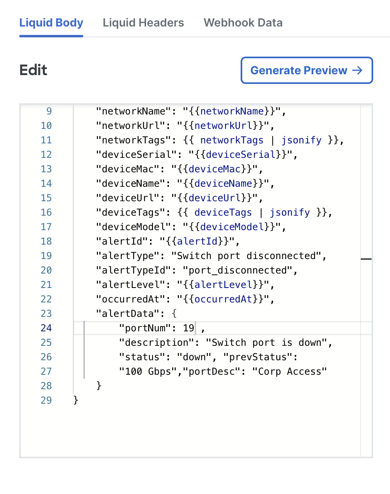
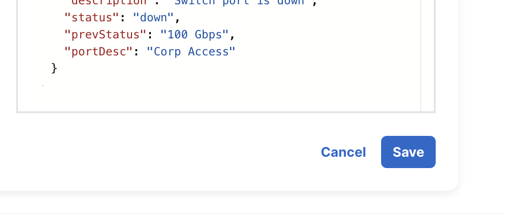
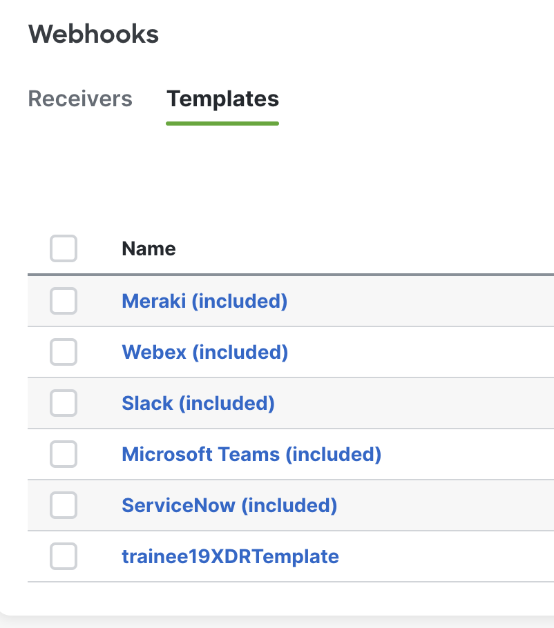

# Create Meraki Webhook Template

1. Go to **Organization > API & webhooks**



2. Click on the **Webhooks** tab.



3. Click on the **Templates** tab in the **Webhooks** section.



4. Click on the **Create template** button on the right side.



5. Give the template a name following the format of **trainee[id]XDRTemplate**. Here is an example:



6. Take the below JSON and paste it into the **Edit** window.

```javascript showLineNumbers
{
    "version": "0.1",
    "sharedSecret": "{{sharedSecret}}",
    "sentAt": "{{sentAt}}",
    "organizationId": "{{organizationId}}",
    "organizationName": "{{organizationName}}",
    "organizationUrl": "{{organizationUrl}}",
    "networkId": "{{networkId}}",
    "networkName": "{{networkName}}",
    "networkUrl": "{{networkUrl}}",
    "networkTags": {{ networkTags | jsonify }},
    "deviceSerial": "{{deviceSerial}}",
    "deviceMac": "{{deviceMac}}",
    "deviceName": "{{deviceName}}",
    "deviceUrl": "{{deviceUrl}}",
    "deviceTags": {{ deviceTags | jsonify }},
    "deviceModel": "{{deviceModel}}",
    "alertId": "{{alertId}}",
    "alertType": "Switch port disconnected",
    "alertTypeId": "port_disconnected",
    "alertLevel": "{{alertLevel}}",
    "occurredAt": "{{occurredAt}}",
    "alertData": {
        "portNum": 1 ,
        "description": "Switch port is down",
        "status": "down", "prevStatus":
        "100 Gbps","portDesc": "Corp Access"
    }
}
```

7. After pasting the JSON, edit the **portNum** from the number 1 to your station number. The edit window should look similar to the below:



8. Click on **Generate Preview** and it should fill in all the {{value}} with a value pulled from the Meraki Network. Of note, the device serial gets replaced with the switch serial number we want.

9. Click **Save** on the bottom right.



10. Go back to the **Templates** tab by clicking on it again, and you should see the new template you created at the bottom of the list:



Now we can move onto creating the Automation workflow in XDR.
