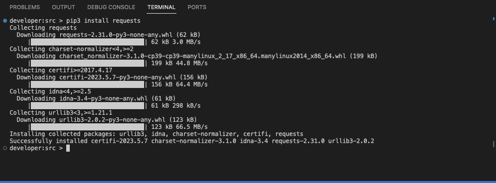
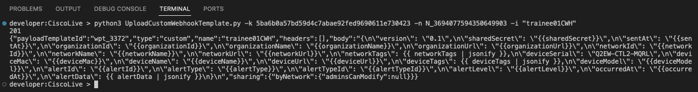
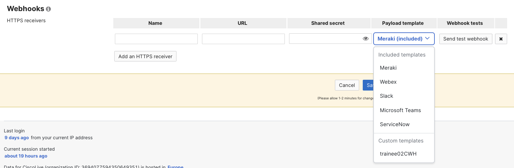

# Using the Meraki API & Webhooks

We first need to create a webhook template and then use the Meraki API to push the webhook template to the Dashboard.

## Create Webhook Template

This **_may_** be done using the [webhook builder](https://webhook-builder-vpfmunhy6a-uc.a.run.app/) for future projects, but, for the purposes of this session, we ar going to edit an already created template.

## Download Code to be run locally

We are going to use some existing code to create our Custom Webhook Template:

```python title='UploadCustomWebhookTemplate.py showLineNumbers'
# this script, for a given
# - API key
# - NetworkID
# - Webhook Template Name
# creates a new custom webhook template
# API information available here: https://developer.cisco.com/meraki/webhooks/#!custom-payload-templates-overview
# precreated templates available here: https://github.com/meraki/webhook-payload-templates
# further training available here: https://developer.cisco.com/learning/labs/meraki-webhook-template-editor-intro/create-your-custom-webhook-template/
# postman collection: https://www.postman.com/meraki-api/workspace/cisco-meraki-s-public-workspace/collection/897512-c65299ed-39a5-4b02-bb4e-933c738bfcdf?action=share&creator=897512&ctx=documentation

import sys, requests, json, getopt


def main(argv):
    ARG_APIKEY = ''
    ARG_NAME = ''
    ARG_NETWORKID = ''

    try:
        opts, args = getopt.getopt(argv, 'hk:n:i:')
    except getopt.GetoptError:
        printhelp()
        sys.exit(2)

    for opt, arg in opts:
        if opt == '-h':
            printhelp()
            sys.exit()
        elif opt == '-k':
            ARG_APIKEY = arg
        elif opt == '-n':
            ARG_NETWORKID = arg
        elif opt == '-i':
            ARG_NAME = arg

        # check that all mandatory arguments have been given
    if ARG_APIKEY == '' or ARG_NETWORKID == '' or ARG_NAME == '':
        printhelp()
        sys.exit(2)

    webhookTemplatePayload = "{\n\"version\": \"0.1\",\n\"sharedSecret\": \"{{sharedSecret}}\",\n\"sentAt\": \"{{sentAt}}\",\n\"organizationId\": \"{{organizationId}}\",\n\"organizationName\": \"{{organizationName}}\",\n\"organizationUrl\": \"{{organizationUrl}}\",\n\"networkId\": \"{{networkId}}\",\n\"networkName\": \"{{networkName}}\",\n\"networkUrl\": \"{{networkUrl}}\",\n\"networkTags\": {{ networkTags | jsonify }},\n\"deviceSerial\": \"{{deviceSerial}}\",\n\"deviceMac\": \"{{deviceMac}}\",\n\"deviceName\": \"{{deviceName}}\",\n\"deviceUrl\": \"{{deviceUrl}}\",\n\"deviceTags\": {{ deviceTags | jsonify }},\n\"deviceModel\": \"{{deviceModel}}\",\n\"alertId\": \"{{alertId}}\",\n\"alertType\": \"{{alertType}}\",\n\"alertTypeId\": \"{{alertTypeId}}\",\n\"alertLevel\": \"{{alertLevel}}\",\n\"occurredAt\": \"{{occurredAt}}\",\n\"alertData\": {{ alertData | jsonify }}\n}\n"

    url = "https://api.meraki.com/api/v1/networks/" + ARG_NETWORKID + "/webhooks/payloadTemplates"

    payload = json.dumps({
        "name": ARG_NAME,
        "body": webhookTemplatePayload
    })

    headers = {
        "Content-Type": "application/json",
        "Accept": "application/json",
        "X-Cisco-Meraki-API-Key": ARG_APIKEY
    }

    response = requests.request("POST", url, headers=headers, data=payload)

    print(response.status_code)
    print(response.text)


def printhelp():
    print("this script, for a given")
    print("-k API key")
    print("-n NetworkID")
    print("-i Webhook Template Name")
    print("creates a new custom webhook template")
    print("The only editing it needs is the webhook template payload")
    print("")
    print("API information available here: https://developer.cisco.com/meraki/webhooks/#!custom-payload-templates-overview")
    print("precreated templates available here: https://github.com/meraki/webhook-payload-templates")
    print("further training available here: https://developer.cisco.com/learning/labs/meraki-webhook-template-editor-intro/create-your-custom-webhook-template/")
    print("postman collection: https://www.postman.com/meraki-api/workspace/cisco-meraki-s-public-workspace/collection/897512-c65299ed-39a5-4b02-bb4e-933c738bfcdf?action=share&creator=897512&ctx=documentation")


if __name__ == '__main__':
    main(sys.argv[1:])
```

Copy the above code into a text editor and save as **UploadCustomWebhookTemplate.py** to your Desktop

### Editting the code

Now, in order to achieve our objective later of disabling a port, we are going to make a small change to the line:

`webhookTemplatePayload = "{\n\"version\": \"0.1\",\n\"sharedSecret\": \"{{sharedSecret}}\",\n\"sentAt\": \"{{sentAt}}\",\n\"organizationId\": \"{{organizationId}}\",\n\"organizationName\": \"{{organizationName}}\",\n\"organizationUrl\": \"{{organizationUrl}}\",\n\"networkId\": \"{{networkId}}\",\n\"networkName\": \"{{networkName}}\",\n\"networkUrl\": \"{{networkUrl}}\",\n\"networkTags\": {{ networkTags | jsonify }},\n\"deviceSerial\": \"{{deviceSerial}}\",\n\"deviceMac\": \"{{deviceMac}}\",\n\"deviceName\": \"{{deviceName}}\",\n\"deviceUrl\": \"{{deviceUrl}}\",\n\"deviceTags\": {{ deviceTags | jsonify }},\n\"deviceModel\": \"{{deviceModel}}\",\n\"alertId\": \"{{alertId}}\",\n\"alertType\": \"{{alertType}}\",\n\"alertTypeId\": \"{{alertTypeId}}\",\n\"alertLevel\": \"{{alertLevel}}\",\n\"occurredAt\": \"{{occurredAt}}\",\n\"alertData\": {{ alertData | jsonify }}\n}\n"`

Where we have `\n\"deviceSerial\": \"{{deviceSerial}}\"` we are going to replace `\"{{deviceSerial}}\"` with \"Q2EW-CTL2-MQRL\"

:::tip
It's imperative that, within the quotes, that you have just the **_serial number_** as above, with no curly brackets, so

`\n\"deviceSerial\": \"Q2EW-CTL2-MQRL\"`
:::

### Open Terminal and Installing Requests

Open the **Terminal** application, and change directory to where you saved **UploadCustomWebhookTemplate.py** as above

We will next need to install the **_Requests_** package. This is essential for making API calls:

Type:

`pip3 install requests`

The **_requests_** package should install as shown:



### Running the code!

For this, you'll need:

Your API Key
Your Network ID

And

A name you wish to give the webhook. **_TraineeXXCWH_** where **_XX_** is your trainee number may be a good suggestion

We need to type in the following to run the code:

`python3 UploadCustomWebhookTemplate.py -k ***YOURAPIKEY*** -n ***YOURNETWORKID*** -i "TraineeXXCWH"`

Press **_Enter_** when ready...

The API call should run, and, if successful, should show:



We can also check by going to, in the Meraki Dashboard:

`Systems Manager > Alerts > Webhooks`

Click `Add an HTTPS receiver`

Under **_Payload Template_** click the drop down box, and you should see:



This means our webhook has been added to the Meraki Dashboard. We can go ahead and start creating the Lambda Function.
