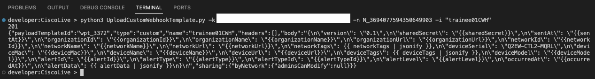
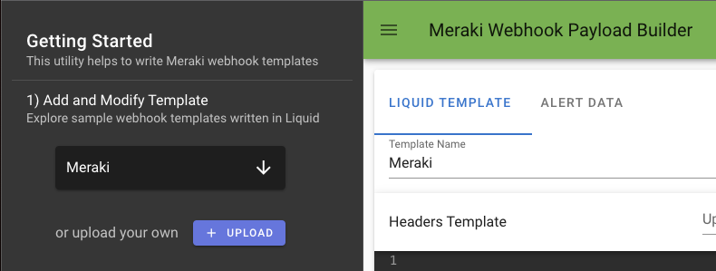

# Using the Meraki API & Webhooks

We first need to create a webhook template and then use the Meraki API to push the webhook template to the Dashboard.

## Create Webhook Template

This **_may_** be done using the [webhook builder](https://webhook-builder-vpfmunhy6a-uc.a.run.app/) for future projects, but, for the purposes of this session, we ar going to edit an already created template.

## Download Code to be run locally

We are going to use some existing code to create our Custom Webhook Template:

```python title='UploadCustomWebhookTemplate.py showLineNumbers'
# this script, for a given
# - API key
# - NetworkID
# - Webhook Template Name
# creates a new custom webhook template
# API information available here: https://developer.cisco.com/meraki/webhooks/#!custom-payload-templates-overview
# precreated templates available here: https://github.com/meraki/webhook-payload-templates
# further training available here: https://developer.cisco.com/learning/labs/meraki-webhook-template-editor-intro/create-your-custom-webhook-template/
# postman collection: https://www.postman.com/meraki-api/workspace/cisco-meraki-s-public-workspace/collection/897512-c65299ed-39a5-4b02-bb4e-933c738bfcdf?action=share&creator=897512&ctx=documentation

import sys, requests, json, getopt


def main(argv):
    ARG_APIKEY = ''
    ARG_NAME = ''
    ARG_NETWORKID = ''

    try:
        opts, args = getopt.getopt(argv, 'hk:n:i:')
    except getopt.GetoptError:
        printhelp()
        sys.exit(2)

    for opt, arg in opts:
        if opt == '-h':
            printhelp()
            sys.exit()
        elif opt == '-k':
            ARG_APIKEY = arg
        elif opt == '-n':
            ARG_NETWORKID = arg
        elif opt == '-i':
            ARG_NAME = arg

        # check that all mandatory arguments have been given
    if ARG_APIKEY == '' or ARG_NETWORKID == '' or ARG_NAME == '':
        printhelp()
        sys.exit(2)

    webhookTemplatePayload = "{\n\"version\": \"0.1\",\n\"sharedSecret\": \"{{sharedSecret}}\",\n\"sentAt\": \"{{sentAt}}\",\n\"organizationId\": \"{{organizationId}}\",\n\"organizationName\": \"{{organizationName}}\",\n\"organizationUrl\": \"{{organizationUrl}}\",\n\"networkId\": \"{{networkId}}\",\n\"networkName\": \"{{networkName}}\",\n\"networkUrl\": \"{{networkUrl}}\",\n\"networkTags\": {{ networkTags | jsonify }},\n\"deviceSerial\": \"{{deviceSerial}}\",\n\"deviceMac\": \"{{deviceMac}}\",\n\"deviceName\": \"{{deviceName}}\",\n\"deviceUrl\": \"{{deviceUrl}}\",\n\"deviceTags\": {{ deviceTags | jsonify }},\n\"deviceModel\": \"{{deviceModel}}\",\n\"alertId\": \"{{alertId}}\",\n\"alertType\": \"{{alertType}}\",\n\"alertTypeId\": \"{{alertTypeId}}\",\n\"alertLevel\": \"{{alertLevel}}\",\n\"occurredAt\": \"{{occurredAt}}\",\n\"alertData\": {{ alertData | jsonify }}\n}\n"

    url = "https://api.meraki.com/api/v1/networks/" + ARG_NETWORKID + "/webhooks/payloadTemplates"

    payload = json.dumps({
        "name": ARG_NAME,
        "body": webhookTemplatePayload
    })

    headers = {
        "Content-Type": "application/json",
        "Accept": "application/json",
        "X-Cisco-Meraki-API-Key": ARG_APIKEY
    }

    response = requests.request("POST", url, headers=headers, data=payload)

    print(response.status_code)
    print(response.text)


def printhelp():
    print("this script, for a given")
    print("-k API key")
    print("-n NetworkID")
    print("-i Webhook Template Name")
    print("creates a new custom webhook template")
    print("The only editing it needs is the webhook template payload")
    print("")
    print("API information available here: https://developer.cisco.com/meraki/webhooks/#!custom-payload-templates-overview")
    print("precreated templates available here: https://github.com/meraki/webhook-payload-templates")
    print("further training available here: https://developer.cisco.com/learning/labs/meraki-webhook-template-editor-intro/create-your-custom-webhook-template/")
    print("postman collection: https://www.postman.com/meraki-api/workspace/cisco-meraki-s-public-workspace/collection/897512-c65299ed-39a5-4b02-bb4e-933c738bfcdf?action=share&creator=897512&ctx=documentation")


if __name__ == '__main__':
    main(sys.argv[1:])
```

Copy the above code into a text editor and save as **UploadCustomWebhookTemplate.py** to your Desktop

### Editting the code

Now, in order to achieve our objective later of disabling a port, we are going to make a small change to the line:

`webhookTemplatePayload = "{\n\"version\": \"0.1\",\n\"sharedSecret\": \"{{sharedSecret}}\",\n\"sentAt\": \"{{sentAt}}\",\n\"organizationId\": \"{{organizationId}}\",\n\"organizationName\": \"{{organizationName}}\",\n\"organizationUrl\": \"{{organizationUrl}}\",\n\"networkId\": \"{{networkId}}\",\n\"networkName\": \"{{networkName}}\",\n\"networkUrl\": \"{{networkUrl}}\",\n\"networkTags\": {{ networkTags | jsonify }},\n\"deviceSerial\": \"{{deviceSerial}}\",\n\"deviceMac\": \"{{deviceMac}}\",\n\"deviceName\": \"{{deviceName}}\",\n\"deviceUrl\": \"{{deviceUrl}}\",\n\"deviceTags\": {{ deviceTags | jsonify }},\n\"deviceModel\": \"{{deviceModel}}\",\n\"alertId\": \"{{alertId}}\",\n\"alertType\": \"{{alertType}}\",\n\"alertTypeId\": \"{{alertTypeId}}\",\n\"alertLevel\": \"{{alertLevel}}\",\n\"occurredAt\": \"{{occurredAt}}\",\n\"alertData\": {{ alertData | jsonify }}\n}\n"`

Where we have `\n\"deviceSerial\": \"{{deviceSerial}}\"` we are going to replace `\"{{deviceSerial}}\"` with \"Q2EW-CTL2-MQRL\"

:::tip
It's imperative that, within the quotes, that you have just the **_serial number_** as above, with no curly brackets, so

`\n\"deviceSerial\": \"Q2EW-CTL2-MQRL\"`
:::

### change directory and Installing Requests

At the bottom of the screen, you should see a **_Terminal_** window. If it's **_NOT_** showing, click on `Terminal`


Firstly, type:

`cd CiscoLive` and then **_ENTER_**

Now, we need to install the **_Requests_** package. This is essential for making API calls:

Type:

`pip3 install requests`

The **_requests_** package should install as shown:


### Running the code!

For this, you'll need:

Your API Key
Your Network ID

And

A name you wish to give the webhook. **_TraineeXXCWH_** where **_XX_** is your trainee number may be a good suggestion

We need to type in the following to run the code:

`python3 UploadCustomWebhookTemplate.py -k ***YOURAPIKEY*** -n ***YOURNETWORKID*** -i "TraineeXXCWH"`

Press **_Enter_** when ready...

The API call should run, and, if successful, should show:



We can also check by going to, in the Meraki Dashboard:

`Systems Manager > Alerts > Webhooks`

Click `Add an HTTPS receiver`

Under **_Payload Template_** click the drop down box, and you should see:


# Using the Meraki API & Webhooks

We first need to create a webhook template and then use the Meraki API to push the webhook template to the Dashboard.

## Create Webhook Template

Since we have the API key and Organization ID from the Meraki Dashboard, let's create the custom webhook template. Go to the [webhook builder](https://webhook-builder-vpfmunhy6a-uc.a.run.app/)

Once there we need to load a pre-done template. We can do this by changing the dropdown on the left side that say `Templates` to `Meraki`. It should now look like the below:  


In the `Body Template`, the JSON should look like the below:

```javascript showLineNumbers
{
"version": "0.1",
"sharedSecret": "{{sharedSecret}}",
"sentAt": "{{sentAt}}",
"organizationId": "{{organizationId}}",
"organizationName": "{{organizationName}}",
"organizationUrl": "{{organizationUrl}}",
"networkId": "{{networkId}}",
"networkName": "{{networkName}}",
"networkUrl": "{{networkUrl}}",
"networkTags": {{ networkTags | jsonify }},
"deviceSerial": "{{deviceSerial}}",
"deviceMac": "{{deviceMac}}",
"deviceName": "{{deviceName}}",
"deviceUrl": "{{deviceUrl}}",
"deviceTags": {{ deviceTags | jsonify }},
"deviceModel": "{{deviceModel}}",
"alertId": "{{alertId}}",
"alertType": "{{alertType}}",
"alertTypeId": "{{alertTypeId}}",
"alertLevel": "{{alertLevel}}",
"occurredAt": "{{occurredAt}}",
"alertData": {{ alertData | jsonify }}
}
```

However, we need to modify this a bit to get some information we need for our Lambda function to process it.

We need to remove the red highlighted lines below and add the green ones.

```javascript showLineNumbers
{
"version": "0.1",
//remove-line
"sharedSecret": "{{sharedSecret}}",
"sentAt": "{{sentAt}}",
"organizationId": "{{organizationId}}",
"organizationName": "{{organizationName}}",
"organizationUrl": "{{organizationUrl}}",
"networkId": "{{networkId}}",
"networkName": "{{networkName}}",
"networkUrl": "{{networkUrl}}",
"networkTags": {{ networkTags | jsonify }},
//remove-line
"deviceSerial": "{{deviceSerial}}",
//add-line
"deviceSerial": "Q2EW-CTL2-MQRL",
"deviceMac": "{{deviceMac}}",
"deviceName": "{{deviceName}}",
"deviceUrl": "{{deviceUrl}}",
"deviceTags": {{ deviceTags | jsonify }},
"deviceModel": "{{deviceModel}}",
"alertId": "{{alertId}}",
"alertType": "{{alertType}}",
"alertTypeId": "{{alertTypeId}}",
"alertLevel": "{{alertLevel}}",
"occurredAt": "{{occurredAt}}",
//remove-line
"alertData": {{ alertData | jsonify }}
//add-line
"alertData": {
    //add-line
    "portNum": attendee-number,
    //add-line
    "description": "Switch port is down",
    //add-line
    "status": "down",
    //add-line
    "prevStatus": "100 Gbps",
    //add-line
    "portDesc": "Corp Access"
    //add-line
  }
}
```

We changed the device serial to be a serial number that is in our organization and added some data to the alert data to simulate a port going down. Please replace the `attendee-number` with the number of the username. `Trainee5` would use the number `5` as the port.

We are doing this because we do not have 20 switches to put into each attendee network and this will make it so we do not have to wait for the alert timer to go off for a port going down.

After this data has been input into the `Body Template` we can go to the right side and select `Meraki API Preview` and copy the Meraki API Request Body`.

It should look similar to what is below:

```javascript showLineNumbers
{
    "name": "Meraki",
    "headers": "",
    "body": "{\n\"version\": \"0.1\",\n\"sentAt\": \"{{sentAt}}\",\n\"organizationId\": \"{{organizationId}}\",\n\"organizationName\": \"{{organizationName}}\",\n\"organizationUrl\": \"{{organizationUrl}}\",\n\"networkId\": \"{{networkId}}\",\n\"networkName\": \"{{networkName}}\",\n\"networkUrl\": \"{{networkUrl}}\",\n\"networkTags\": {{ networkTags | jsonify }},\n\"deviceSerial\": \"Q2EW-CTL2-MQRL\",\n\"deviceMac\": \"{{deviceMac}}\",\n\"deviceName\": \"{{deviceName}}\",\n\"deviceUrl\": \"{{deviceUrl}}\",\n\"deviceTags\": {{ deviceTags | jsonify }},\n\"deviceModel\": \"{{deviceModel}}\",\n\"alertId\": \"{{alertId}}\",\n\"alertType\": \"{{alertType}}\",\n\"alertTypeId\": \"{{alertTypeId}}\",\n\"alertLevel\": \"{{alertLevel}}\",\n\"occurredAt\": \"{{occurredAt}}\",\n\"alertData\": {\n    \"portNum\": 3,\n    \"description\": \"Switch port is down\",\n    \"status\": \"down\",\n    \"prevStatus\": \"100 Gbps\",\n    \"portDesc\": \"Corp Access\"\n  }\n}\n"
}
```

However, there are some things we need changed. Take the body and paste it into a text file. Then remove the `headers` section and change the `name`. Please make the name the same as your login username. Then we need to remove the `\n` characters. To remove those characters you can do a find in the document for `\n` and then a replace all with a space.

It should look like the below:

```javascript showLineNumbers
{
    "name": "rymaclen",
    "body": "{\"version\": \"0.1\",\"sentAt\": \"{{sentAt}}\",\"organizationId\": \"{{organizationId}}\",\"organizationName\": \"{{organizationName}}\",\"organizationUrl\": \"{{organizationUrl}}\",\"networkId\": \"{{networkId}}\",\"networkName\": \"{{networkName}}\",\"networkUrl\": \"{{networkUrl}}\",\"networkTags\": {{ networkTags | jsonify }},\"deviceSerial\": \"Q2EW-CTL2-MQRL\",\"deviceMac\": \"{{deviceMac}}\",\"deviceName\": \"{{deviceName}}\",\"deviceUrl\": \"{{deviceUrl}}\",\"deviceTags\": {{ deviceTags | jsonify }},\"deviceModel\": \"{{deviceModel}}\",\"alertId\": \"{{alertId}}\",\"alertType\": \"{{alertType}}\",\"alertTypeId\": \"{{alertTypeId}}\",\"alertLevel\": \"{{alertLevel}}\",\"occurredAt\": \"{{occurredAt}}\",\"alertData\": {    \"portNum\": 3,    \"description\": \"Switch port is down\",    \"status\": \"down\",    \"prevStatus\": \"100 Gbps\",    \"portDesc\": \"Corp Access\"  }}"
}
```

This is our completed webhook template. Now we can upload the template to the Meraki Dashboard.

## Upload the Template

To upload the template, we need to use the below curl command:

```bash
curl https://api.meraki.com/api/v1/networks/network-id-here/webhooks/payloadTemplates --header "Content-Type: application/json" --header "Accept: application/json" --header "X-Cisco-Meraki-API-Key: api-key-here" --data 'template-data'
```

Please replace the `network-id-here` with the network ID we obtained saved. Then do the same with the `api-key-here`. Where it says `template data`. Please paste the template between the two quotes. It should look similar to the below:

```bash
curl https://api.meraki.com/api/v1/networks/network-id-here/webhooks/payloadTemplates --header "Content-Type: application/json" --header "Accept: application/json" --header "X-Cisco-Meraki-API-Key: api-key-here" --data '{
    "name": "rymaclen",
    "body": "{\"version\": \"0.1\",\"sentAt\": \"{{sentAt}}\",\"organizationId\": \"{{organizationId}}\",\"organizationName\": \"{{organizationName}}\",\"organizationUrl\": \"{{organizationUrl}}\",\"networkId\": \"{{networkId}}\",\"networkName\": \"{{networkName}}\",\"networkUrl\": \"{{networkUrl}}\",\"networkTags\": {{ networkTags | jsonify }},\"deviceSerial\": \"Q2EW-CTL2-MQRL\",\"deviceMac\": \"{{deviceMac}}\",\"deviceName\": \"{{deviceName}}\",\"deviceUrl\": \"{{deviceUrl}}\",\"deviceTags\": {{ deviceTags | jsonify }},\"deviceModel\": \"{{deviceModel}}\",\"alertId\": \"{{alertId}}\",\"alertType\": \"{{alertType}}\",\"alertTypeId\": \"{{alertTypeId}}\",\"alertLevel\": \"{{alertLevel}}\",\"occurredAt\": \"{{occurredAt}}\",\"alertData\": {    \"portNum\": 3,    \"description\": \"Switch port is down\",    \"status\": \"down\",    \"prevStatus\": \"100 Gbps\",    \"portDesc\": \"Corp Access\"  }}"
}'
```

Now, you can copy this command this command and run it in the terminal. You should get back a response like the below:

```bash
{"payloadTemplateId":"wpt_3044","type":"custom","name":"Meraki-tet-v001","headers":[],"body":"{\"version\": \"0.1\",\"sharedSecret\": \"{{sharedSecret}}\",\"sentAt\": \"{{sentAt}}\",\"organizationId\": \"{{organizationId}}\",\"organizationName\": \"{{organizationName}}\",\"organizationUrl\": \"{{organizationUrl}}\",\"networkId\": \"{{networkId}}\",\"networkName\": \"{{networkName}}\",\"networkUrl\": \"{{networkUrl}}\",\"networkTags\": {{ networkTags | jsonify }},\"deviceSerial\": \"{{deviceSerial}}\",\"deviceMac\": \"{{deviceMac}}\",\"deviceName\": \"{{deviceName}}\",\"deviceUrl\": \"{{deviceUrl}}\",\"deviceTags\": {{ deviceTags | jsonify }},\"deviceModel\": \"{{deviceModel}}\",\"alertId\": \"{{alertId}}\",\"alertType\": \"{{alertType}}\",\"alertTypeId\": \"{{alertTypeId}}\",\"alertLevel\": \"{{alertLevel}}\",\"occurredAt\": \"{{occurredAt}}\",\"alertData\": {    \"portNum\": 2,    \"description\": \"Switch port is down\",    \"status\": \"up\",    \"prevStatus\": \"100 Gbps\",    \"portDesc\": \"Corp Access\"  }}"}%
```

This means our webhook has been added to the Meraki Dashboard. We can go ahead and start creating the Lambda Function.
