# Creating a Workflow

When creating a workflow without using the built in Meraki integraiton, we first need to be able to store the API key in a secure way within XDR, then we can use it in the workflow.

## Create a Secure Workflow Variable

1. After logging into XDR, go to **Automate -> Variables**
   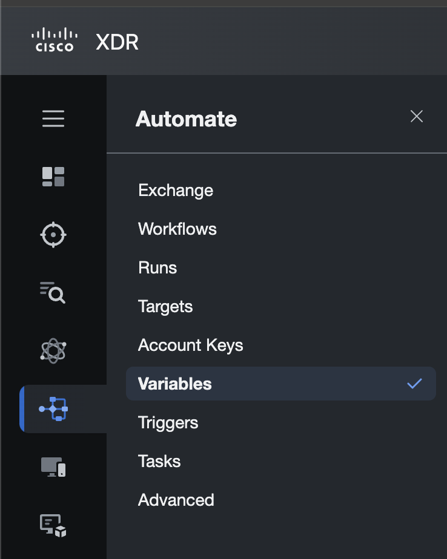

2. Then click on the **+ New Variable** button on the right side to create a new variables
   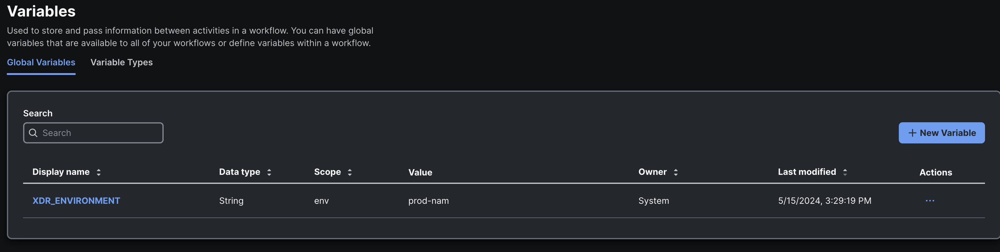

3. In the fields of the new variable change them as follows:

- **Data Type** -> _Secure String_
- **Display Name** -> _[stationNumber]MerakiKey_
- **Scope** -> Environment
- **Value** -> meraki api key from earlier

  It should look similar to the below:
  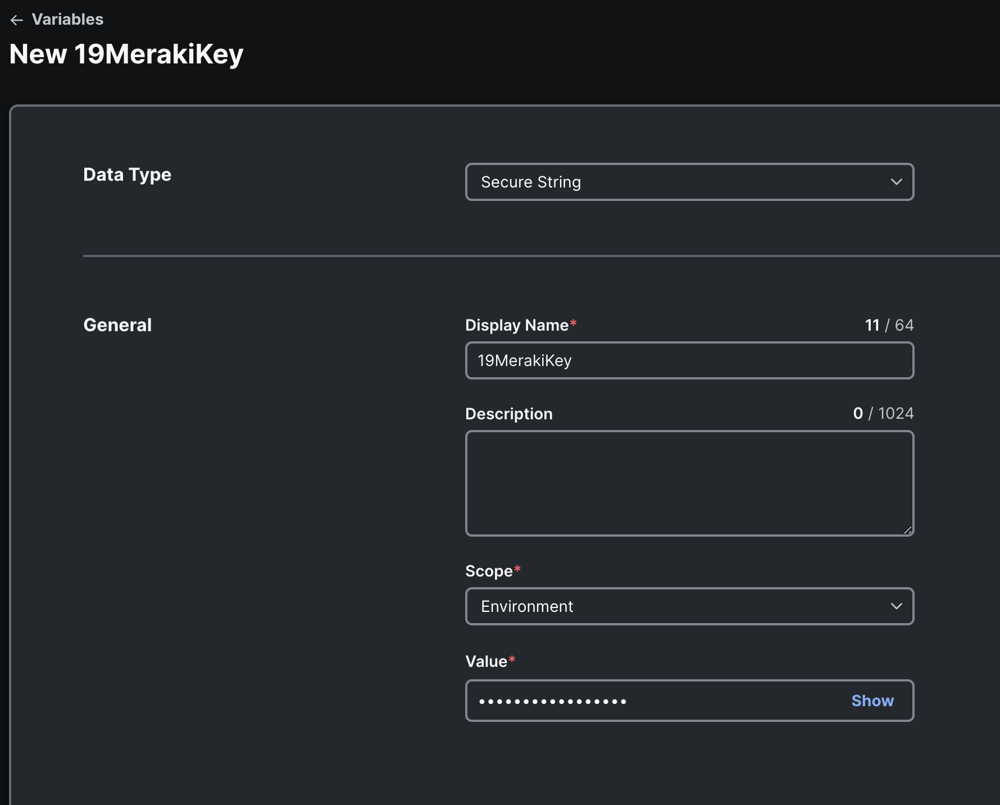

4. Click **Save** on the bottom right.

   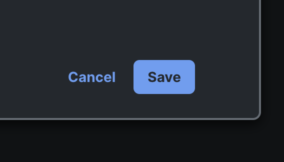

Now we can work on making the workflow

## Create a Workflow

To create a workflow, we first need to to go to the workflow editor. Then we can create our workflow.

1. Go to **Automate -> Worflows**
   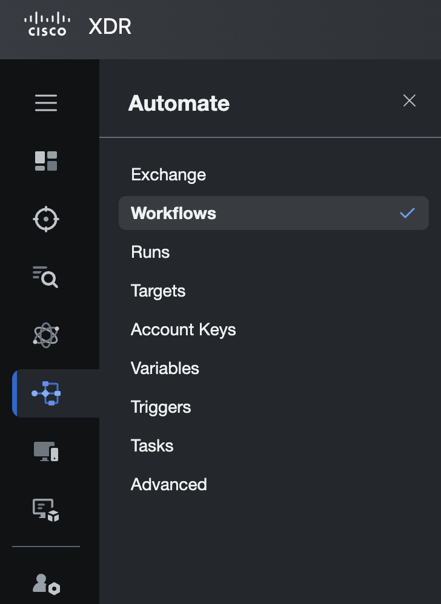
2. Click on **Create Workflow** on the far right of the screen.
   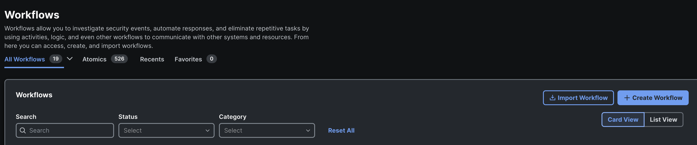
3. Leave the **Blank Custom Workflow** selected and click on \*\*Continue on the bottom right of the pop up.
   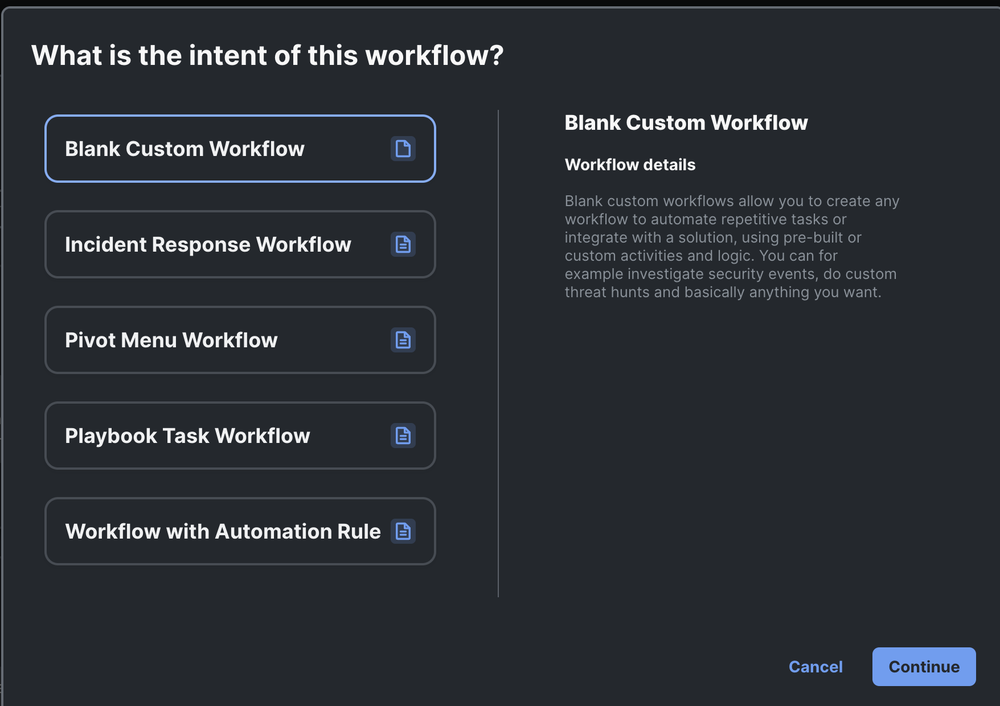
4. Now we can name the workflow. Please use your workstation ID followed by MerakiWF. It should look like the below example:
   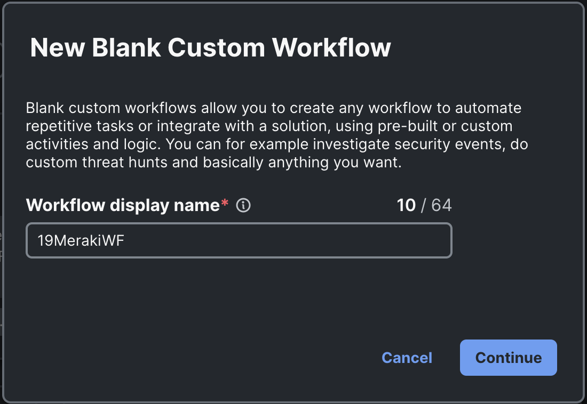
5. This bring you to a blank workflow like the below:
   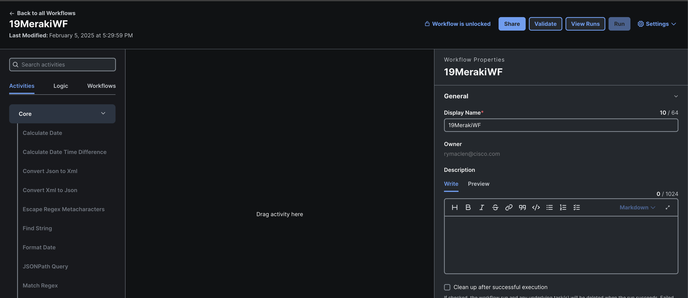

### JSONPath Query

1. We need to first be able to read data from the webhook when Meraki sends it. To do this, we can search for _JSONPath_ in the top left search bar. It should return a **JSONPath Query**. Click and drag it into the workflow editor area. It should look like the below:
   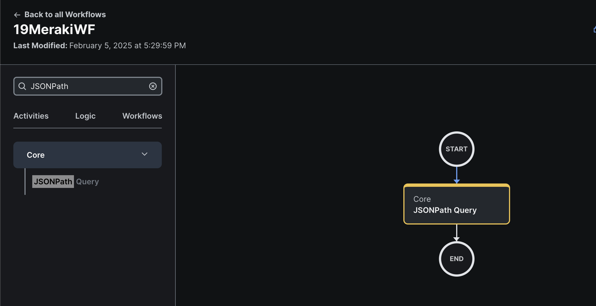
2. We will be changing the data being fed into the **JSONPath Query** later, but for now, we need some dummy data to make sure the workflow is valid. Take the below JSON and paste it into **Source JSON to Query** box on the right side.

```javascript
{
  "version": "0.1",
  "sharedSecret": "",
  "sentAt": "2023-01-13T19:57:07.307562Z",
  "organizationId": "000000",
  "organizationName": "EX net",
  "organizationUrl": "https://n471.meraki.com/o/000000/manage/organization/overview",
  "networkId": "N_00000000",
  "networkName": "Ex net",
  "networkUrl": "https://n471.meraki.com/ex_net/n/000000/manage/nodes/wired_status",
  "networkTags": [],
  "deviceSerial": "Q00Y-U00R-T00G",
  "deviceMac": "00:00:00:d7:14:83",
  "deviceName": "Home MX",
  "deviceUrl": "https://n471.meraki.com/ex_net/n/000000/manage/nodes/new_wired_status",
  "deviceTags": [],
  "deviceModel": "MX67W",
  "alertId": "",
  "alertType": "Switch port disconnected",
  "alertTypeId": "port_disconnected",
  "alertLevel": "warning",
  "occurredAt": "2023-01-13T19:57:07.259607Z",
  "alertData": {
    "portNum": 3,
    "description": "Switch port is down",
    "status": "down",
    "prevStatus": "100 Gbps",
    "portDesc": "Corp Access"
  }
}
```

It should look like the below now:
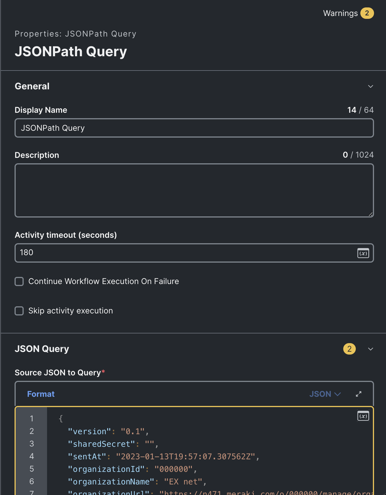

3. Now we need to create 4 **JSONPath Queries**
   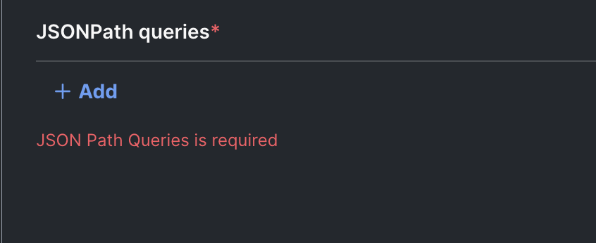

4. The first query will be to get the devices serial number. Click on **+ Add**, then fill in the 3 fields like the below:

- JSONPath Query -> $.deviceSerial
- Property Name -> deviceSerial
- Property Type -> String
  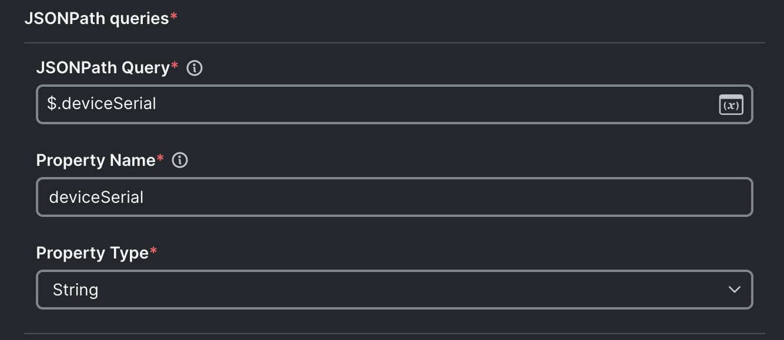

5. We will repeat this 3 more times for these queries:

   | JSONPath Query      | Property Name | Property Type |
   | ------------------- | ------------- | ------------- |
   | $.alertTypeId       | alertType     | String        |
   | $.alertData.status  | portStatus    | String        |
   | $.alertData.portNum | portNum       | String        |

   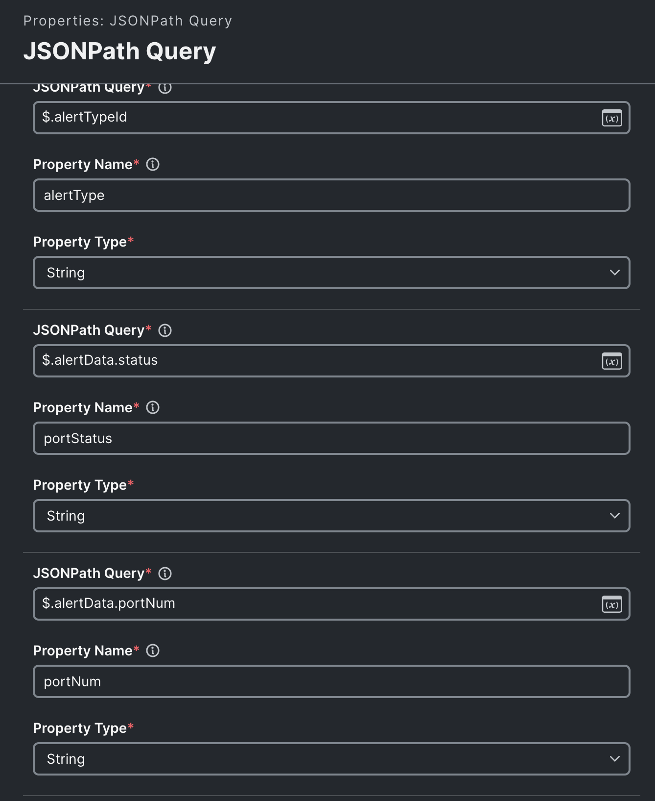

6. Now we need to check the box **Continue Workflow Execution On Failure**
   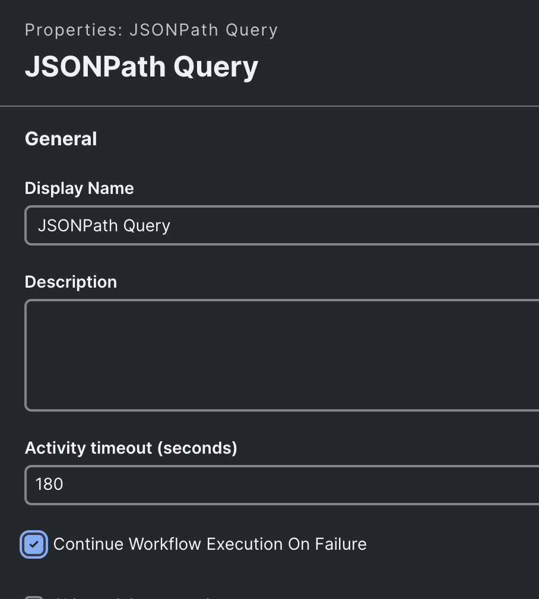
   With this done, we can now pass this data to other parts of our workflow.

### Condition Block

1. We need to check that we got the right type of alert from the webhook and that we got a specific port status. To do that, we can add a **Condition Block**. We can search for _condition_ in the top left search box and then drag the **Condition Block** item into the editor below the JSONPath Query.
   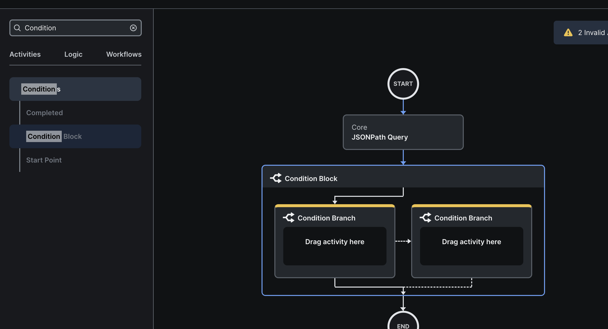

2. Delete the second **Condition Branch** by clicking on the 3 dots on the top right of it and selecting **Delete**
   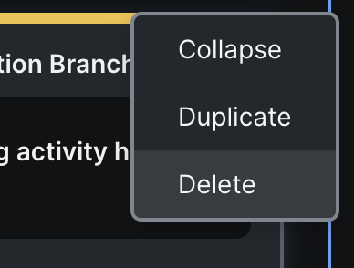
   Now we should have something similar to the below:
   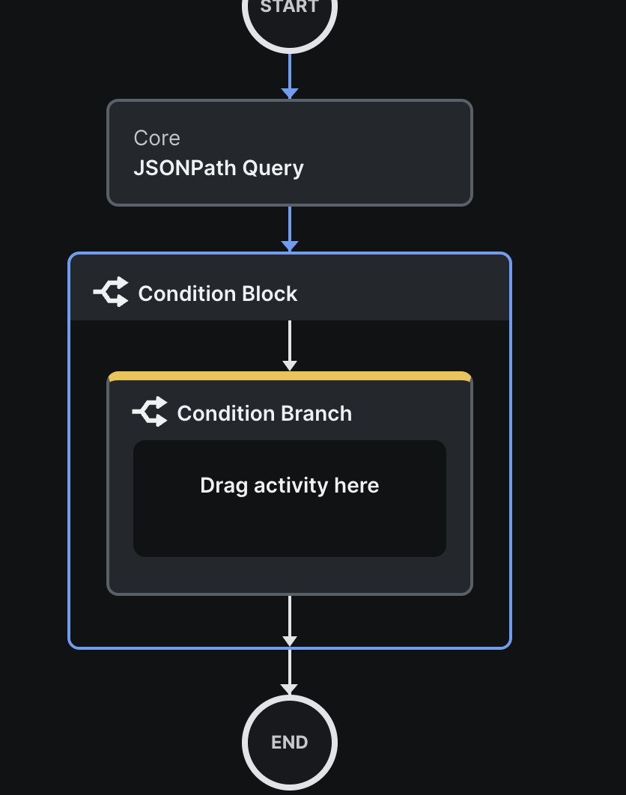

3. Click on the one condition block that is left and click on the **Condition** drop down to expand it.

4. We are going to create two conditions we want to check. Thr first is to check for the type of alert we received. To do that we can select the small browser window icon in the **Property** text box. Then go to **Activities -> JSONPath Query -> Jsonpath Queries -> alertType**. Click on **Save**
   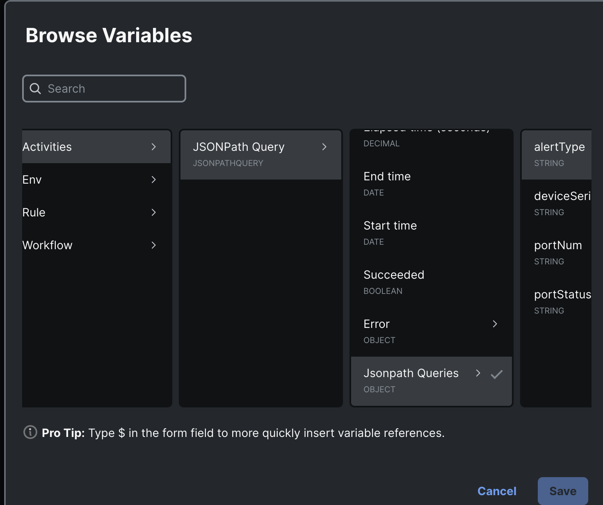

5. Now we can set the value to _port_disconnected_ by typing it into the **Value** field. The condition should look like the below.
   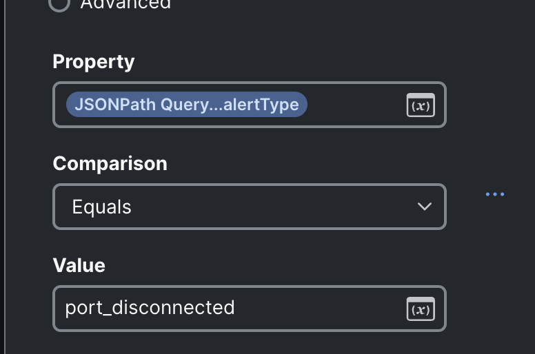

6. Now we can create the second condition. We want to set the **Property** field to portStatus using the selector from before. And set the **Value** to _down_. It should look similar to the below image:
   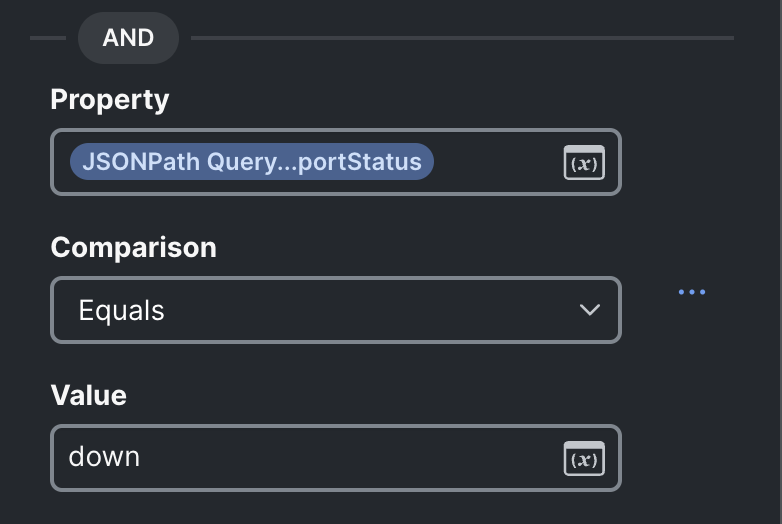

These are all the conditions we need to look for. Now we want to add what action we will take in the workflow when the condition is true.

### HTTP Request

1. Search for _http_ in the left search box and drag the **HTTP Request** item into the condition block.
   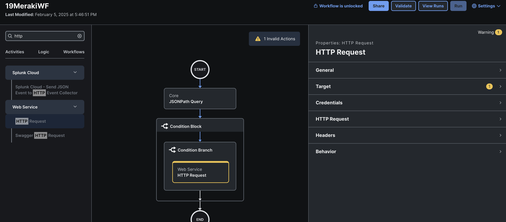

2. Click the **Target** dropdown on the right side to expand its options. Then click on **override workflow target**
   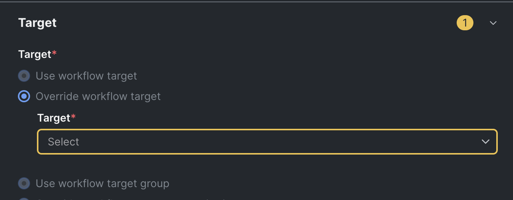

3. Click into the **Target** field and click on **+ Add New**
   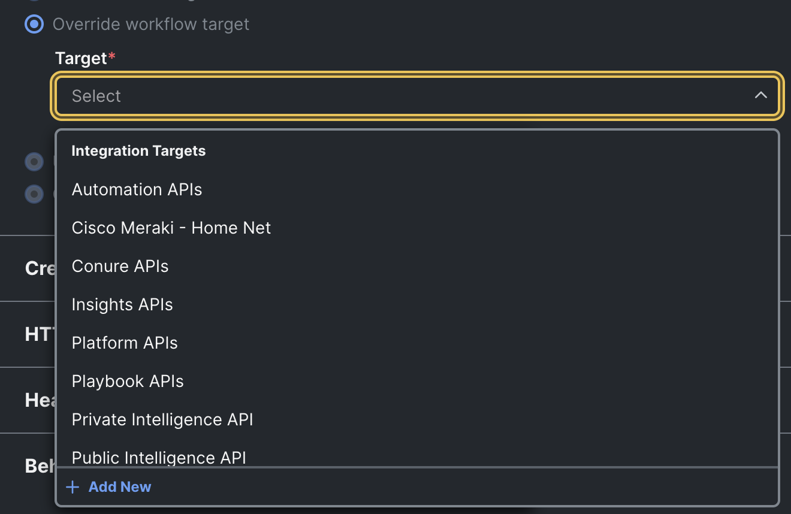

4. Set the fields like the below:

- Display Name -> [stationID]MerakiApi
- No Account Keys -> true
- Protocol -> https
- Host/IPAddress -> api.meraki.com

  It should look similar to the below image:
  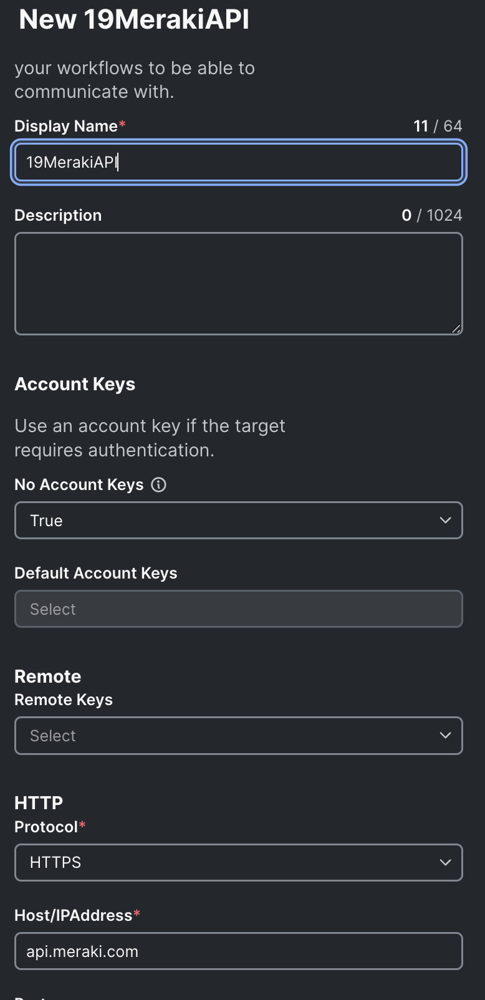

5. Click **Save**

6. Expand the **HTTP Request** section

7. In the **Relative URL** field, type in _/api/v1/devices/_

8. Click on the small selector we have used before and pick the **deviceSerial** variable.

9. Continue typing after the device serial is filled in with this: _/switch/ports/_

10. Click on the selector and select the **portNum** variable. The URL should look similar to the below:
    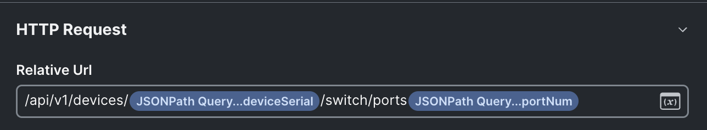

11. Now change the **Method** to **PUT**

12. In the **Request Body** paste in the below JSON:

```javascript
{ "enabled": false }
```

The **HTTP Request** section should look like the below:
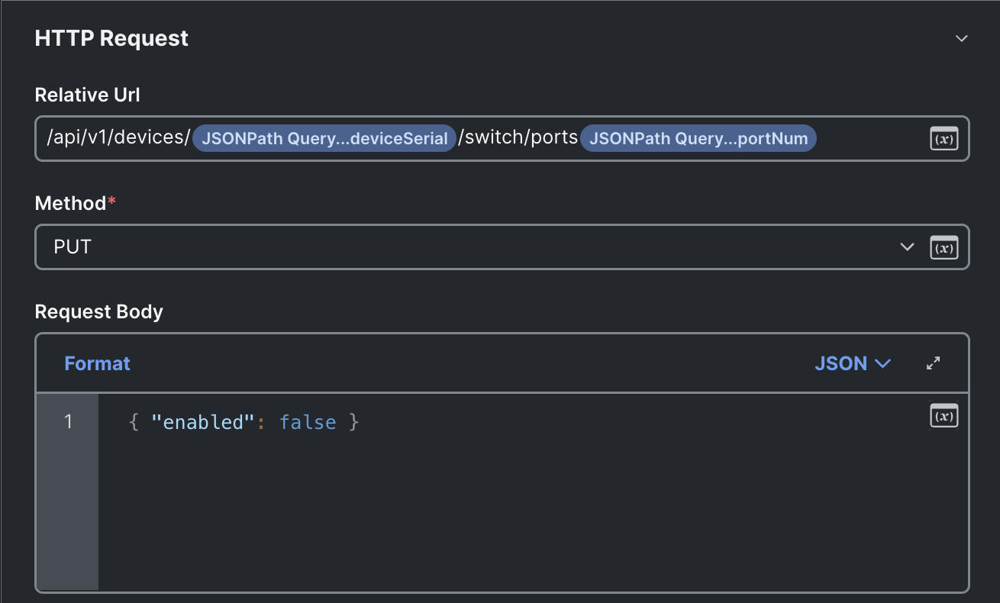

13. Expand the **Headers** section

14. Change the **Content Type** field to **Application JSON**

15. Put _application/json_ into the **Accept** field

16. Now we need to add some custom headers. Under **Header** press the **+ Add** to add a new field.

17. In the new field put _X-Cisco-Meraki-API-Key_ in the **Header** field.

18. In the **Value** field, click on the selector button then select **Env -> yourMerakiKey**. Click **Save**
    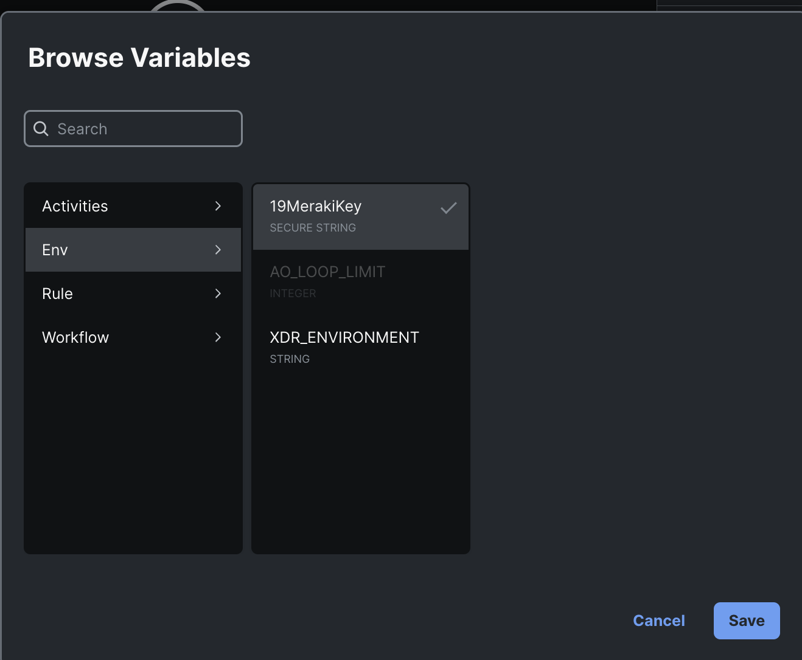

19. Lastly, click on **Validate** on the top right

This concludes the workflow work until we have made a trigger and an Automation Rule to pass the webhook data to the workflow.
