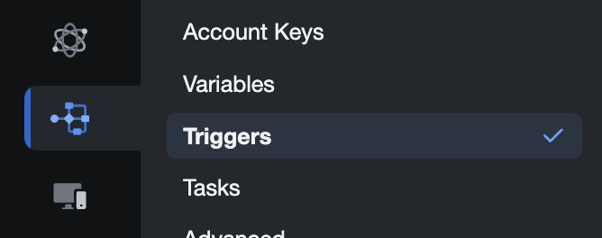
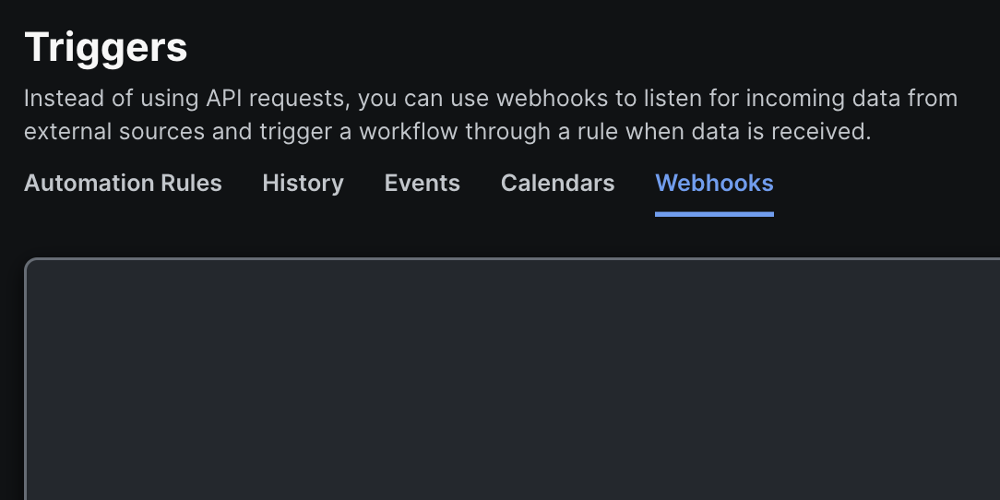

# Creating a Trigger and Automation Rule

Now we need to create a trigger, this will be what is used to make our workflow start automatically based on an event that is sent to the trigger.

## Create a Webhook Trigger

1. Click on **Back to all Workflows** on the top left of the screen. Then go to **Automate -> Triggers**
   

2. On the **Triggers** page, click on **Webhooks**
   

3. Click on **+ New Webhook**

4. In the **Display Name** field, give it your station ID followed by _MerakiWF_, ex: _19MerakiWF_

5. Click Save. There should be a new webhook in the list of webhooks. Click on yours.

6. Copy the **Webhook API Key** and **Webhook URL** and save them in a text file. We will use these back in Meraki when we finish up here.

## Create an Automation Rule

1. Go back to the **Webhooks** page and click on the **Automation Rules** tab.

2. Click on **+ Add Automation Rule** on the right side of the page.

3. Change the **Type** to **Webhook Rule**

4. Change the **Title** to your station ID followed by MerakiAR, ex: _19MerakiAR_

5. In the **Webhook** section, change the \*_Webhok_ to the webhook you made.

6. Lastly, in the **Apply to selected workflows** section, select the workflow you made earlier.

7. Click **Save**

We have made a webhook to send our Meraki alert to and setup an automation rule to run our workflow when the webhook is sent something. Now we need to update our workflow to use the data from the webhook.
